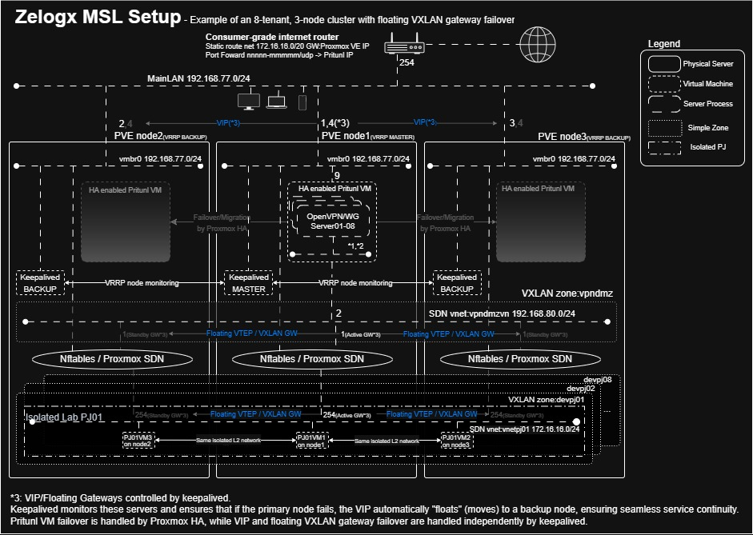

# Multiverse Secure Lab(MSL) Setup for Proxmox by Zelogx™ - The Multi-tenant Enabler Step by step building guide

[](https://github.com/zelogx/msl-setup/discussions)
[](https://www.zelogx.com/ja/)
[](https://www.zelogx.com/ja/documents/release-notes/)

## 目次

- [要件](#%E8%A6%81%E4%BB%B6)
- [概要](#%E6%A6%82%E8%A6%81)
- [ネットワーク構成図](#%E3%83%8D%E3%83%83%E3%83%88%E3%83%AF%E3%83%BC%E3%82%AF%E6%A7%8B%E6%88%90%E5%9B%B3)
- [ネットワーク設計・セグメント設計](#%E3%83%8D%E3%83%83%E3%83%88%E3%83%AF%E3%83%BC%E3%82%AF%E8%A8%AD%E8%A8%88%E3%83%BB%E3%82%BB%E3%82%B0%E3%83%A1%E3%83%B3%E3%83%88%E8%A8%AD%E8%A8%88)
- [メインルータの設定変更](#%E3%83%A1%E3%82%A4%E3%83%B3%E3%83%AB%E3%83%BC%E3%82%BF%E3%81%AE%E8%A8%AD%E5%AE%9A%E5%A4%89%E6%9B%B4)
  - [port forwardを設定します。OpenVPN,WireGuard用 x PJ数分](#port-forward%E3%82%92%E8%A8%AD%E5%AE%9A%E3%81%97%E3%81%BE%E3%81%99openvpnwireguard%E7%94%A8-x-pj%E6%95%B0%E5%88%86)
  - [Static Route](#static-route)
- [Proxmox SDNの設定](#proxmox-sdn%E3%81%AE%E8%A8%AD%E5%AE%9A)
  - [Zoneの作成](#zone%E3%81%AE%E4%BD%9C%E6%88%90)
    - [Peer Address Listの設定方法](#peer-address-list%E3%81%AE%E8%A8%AD%E5%AE%9A%E6%96%B9%E6%B3%95)
  - [VNet（仮想L2セグメント）の作成](#vnet%E4%BB%AE%E6%83%B3l2%E3%82%BB%E3%82%B0%E3%83%A1%E3%83%B3%E3%83%88%E3%81%AE%E4%BD%9C%E6%88%90)
    - [DMZ用（vpn-dmz-vnet）](#dmz%E7%94%A8vpn-dmz-vnet)
    - [開発(Tenant)LAN用](#%E9%96%8B%E7%99%BAtenantlan%E7%94%A8)
    - [Apply](#apply)
  - [IPSetの作成](#ipset%E3%81%AE%E4%BD%9C%E6%88%90)
- [Proxmox Firewallを設定](#proxmox-firewall%E3%82%92%E8%A8%AD%E5%AE%9A)
- [VXLANのゲートウェイの作成とVPN戻り経路の作成](#vxlan%E3%81%AE%E3%82%B2%E3%83%BC%E3%83%88%E3%82%A6%E3%82%A7%E3%82%A4%E3%81%AE%E4%BD%9C%E6%88%90%E3%81%A8vpn%E6%88%BB%E3%82%8A%E7%B5%8C%E8%B7%AF%E3%81%AE%E4%BD%9C%E6%88%90)
  - [以下のファイルを作ります](#%E4%BB%A5%E4%B8%8B%E3%81%AE%E3%83%95%E3%82%A1%E3%82%A4%E3%83%AB%E3%82%92%E4%BD%9C%E3%82%8A%E3%81%BE%E3%81%99)
  - [Reboot](#reboot)
- [VXLANゲートウェイの冗長化を行う](#vxlan%E3%82%B2%E3%83%BC%E3%83%88%E3%82%A6%E3%82%A7%E3%82%A4%E3%81%AE%E5%86%97%E9%95%B7%E5%8C%96%E3%82%92%E8%A1%8C%E3%81%86)
  - [概要](#%E6%A6%82%E8%A6%81-1)
    - [keepalived, garpのインストール](#keepalived-garp%E3%81%AE%E3%82%A4%E3%83%B3%E3%82%B9%E3%83%88%E3%83%BC%E3%83%AB)
    - [keepalivedのコンフィグ](#keepalived%E3%81%AE%E3%82%B3%E3%83%B3%E3%83%95%E3%82%A3%E3%82%B0)
    - [MASTER/BACKUPノード用のVXLANゲートウェイ作成スクリプトの作成](#masterbackup%E3%83%8E%E3%83%BC%E3%83%89%E7%94%A8%E3%81%AEvxlan%E3%82%B2%E3%83%BC%E3%83%88%E3%82%A6%E3%82%A7%E3%82%A4%E4%BD%9C%E6%88%90%E3%82%B9%E3%82%AF%E3%83%AA%E3%83%97%E3%83%88%E3%81%AE%E4%BD%9C%E6%88%90)
    - [テスト](#%E3%83%86%E3%82%B9%E3%83%88)
- [Pritunl VM を作成](#pritunl-vm-%E3%82%92%E4%BD%9C%E6%88%90)
  - [Ubuntu24.04 をminimalでインストール](#ubuntu2404-%E3%82%92minimal%E3%81%A7%E3%82%A4%E3%83%B3%E3%82%B9%E3%83%88%E3%83%BC%E3%83%AB)
  - [setup key取得](#setup-key%E5%8F%96%E5%BE%97)
  - [ブラウザで192.168.77.9にアクセス](#%E3%83%96%E3%83%A9%E3%82%A6%E3%82%B6%E3%81%A7192168779%E3%81%AB%E3%82%A2%E3%82%AF%E3%82%BB%E3%82%B9)
  - [デフォルトパスワード取得](#%E3%83%87%E3%83%95%E3%82%A9%E3%83%AB%E3%83%88%E3%83%91%E3%82%B9%E3%83%AF%E3%83%BC%E3%83%89%E5%8F%96%E5%BE%97)
  - [Pritunl（GUI）](#pritunlgui)
  - [Pritunl VMのハーデニング](#pritunl-vm%E3%81%AE%E3%83%8F%E3%83%BC%E3%83%87%E3%83%8B%E3%83%B3%E3%82%B0)
  - [参考：Pritunl VMのその他の設定](#%E5%8F%82%E8%80%83pritunl-vm%E3%81%AE%E3%81%9D%E3%81%AE%E4%BB%96%E3%81%AE%E8%A8%AD%E5%AE%9A)
- [セルフケアポータルの作成](#%E3%82%BB%E3%83%AB%E3%83%95%E3%82%B1%E3%82%A2%E3%83%9D%E3%83%BC%E3%82%BF%E3%83%AB%E3%81%AE%E4%BD%9C%E6%88%90)
  - [Group, Pool, Userの作成](#group-pool-user%E3%81%AE%E4%BD%9C%E6%88%90)
  - [GroupにPermissionとRoleを与える](#group%E3%81%ABpermission%E3%81%A8role%E3%82%92%E4%B8%8E%E3%81%88%E3%82%8B)
  - [Poolにリソース追加](#pool%E3%81%AB%E3%83%AA%E3%82%BD%E3%83%BC%E3%82%B9%E8%BF%BD%E5%8A%A0)
  - [VPNユーザがProxmox dashboardにアクセス出来るようにする](#vpn%E3%83%A6%E3%83%BC%E3%82%B6%E3%81%8Cproxmox-dashboard%E3%81%AB%E3%82%A2%E3%82%AF%E3%82%BB%E3%82%B9%E5%87%BA%E6%9D%A5%E3%82%8B%E3%82%88%E3%81%86%E3%81%AB%E3%81%99%E3%82%8B)
- [重要なセキュリティ注意事項：新規ユーザには必ず MFA を有効化してください](#%E9%87%8D%E8%A6%81%E3%81%AA%E3%82%BB%E3%82%AD%E3%83%A5%E3%83%AA%E3%83%86%E3%82%A3%E6%B3%A8%E6%84%8F%E4%BA%8B%E9%A0%85%E6%96%B0%E8%A6%8F%E3%83%A6%E3%83%BC%E3%82%B6%E3%81%AB%E3%81%AF%E5%BF%85%E3%81%9A-mfa-%E3%82%92%E6%9C%89%E5%8A%B9%E5%8C%96%E3%81%97%E3%81%A6%E3%81%8F%E3%81%A0%E3%81%95%E3%81%84)
- [課題](#%E8%AA%B2%E9%A1%8C)
- [D2D Operation](#d2d-operation)
  - [pj01adminがVM作成時](#pj01admin%E3%81%8Cvm%E4%BD%9C%E6%88%90%E6%99%82)
  - [VMインストール時](#vm%E3%82%A4%E3%83%B3%E3%82%B9%E3%83%88%E3%83%BC%E3%83%AB%E6%99%82)

## 要件
- Proxmoxがインストールされていること
- PVE9.0.11以降にアップデートされていること。これ以下のバージョンでは動作未確認のため
- Proxmoxはシングルでも、複数ノードクラスタ構成でも良い。

## 概要
これから実施する項目の概要を以下に列挙します。
- ルータに静的経路一つと、ポートフォワード（プロジェクト数分ｘ２）の設定を行う。
- Proxmox SDNの設定
  - Proxmox SDNのVXLAN Zoneをプロジェクト(テナント)数分と、VPNユーザがテナントにアクセスするための経路用ゾーンを作る。
  - Proxmox SDNのVNet(いわゆるbridge、またはセグメントと同じ)を上記で作ったZone内に作る。
  - VnetにIPアドレスとゲートウェイを割り当てる。ここまでで、プロジェクト(テナント)毎に分離されたネットワークの作成が完了する。
  - 上記までで作成した各セグメント間のFirewallルールを設定する。
  - VXLANのゲートウェイは自動では作られないため、ゲートウェイ作成スクリプトで作成する。
- Pritunl VMの構築
  - PritunlのVMを構築し、ネットワークの疎通を確認後、各プロジェクト(テナント)用のServerを作成する。
  - PritunlにOrganizationを作成し、各プロジェクト(テナント)用のServerにアタッチする。
  - Pritunlで利用するポートがSELinuxのデフォルトポート番号で利用できない場合
- VXLANゲートウェイの冗長化を行う
  - 概要 - 複数ノードクラスタ構成の場合、本作業を行う事で可用性を向上する。
  - keepalivedのインストール、keepalivedのコンフィグ
  - MASTER/BACKUPノード用のVXLANゲートウェイ作成スクリプトの作成
  - テスト
- セルフケアポータルの作成

## ネットワーク構成図
これから作成するネットワークは以下の通り。
決定しなければならないネットワークアドレス/CIDRなどは図中のa～iです。


なお、3ノードクラスタ構成においては、以下のようなものが出来ます。


## ネットワーク設計・セグメント設計

以下で定義するネットワークアドレス/CIDRが他で使用されていない事さえ確認できれば良い。

### a. MainLAN(vmbr0既設) : 192.168.77.0/24: GW:.254
　→　自宅ラボ・家電 mainのcentos stream 10(.1 zelogx webサーバ, nextcloud, samba, 個人用OpenVPN/WireGuard, Unbound DNSなど), 家庭のalexaやTV, PS5, Internet router, 家族のPC, スマホなど様々。
　後続の「PritunlのMainLAN側のIP」がこのIPレンジ内でなくてはならない。
　インターネットルータの多くはLAN側IPにしかポート転送できないので、インターネットルータの直下のLANに接続してあることが望ましい。

### b. Proxmox PVEのMainLANのIP:192.168.77.2:
インターネットルータへのstatic route追加時、宛先IPとなる。

### c. vpndmzvn(新設): 192.168.80.0/24 GW:192.168.80.1 VPNクライアントが各開発PJ用サブネットへアクセスするための経路　最低/30のネットワークアドレスが必要。

### d. VPNクライアントへの配布IPレンジ：192.168.81.0/24
この配布IPレンジはVPNクライアントが接続時に割り当てられるIPアドレスレンジです。<br>
WireGuardgとOpenVPNで更に分割されます。<br>
例：<br>
- OpenVPN  :192.168.81.002-126/25
- WireGuard:192.168.81.129-254/25

これを更に「作成する開発用分離セグメントの作成数」で分割し/28とする。<br>
各PJ用にVPNできるクライアント数は最大13人となる。<br>
オフショア分散開発などはもっと多目に確保するとよい。

各プロジェクトごとのVPNクライアントへの配布IPと最大VPNクライアント数(OpenVPN用)
| PJ  | Subnet            | IP range                      | # of VPN clients |
| --: | ----------------- | ----------------------------- |-:|
| 1   | 192.168.81.0/28   | 192.168.81.2–192.168.81.14    |13|
| 2   | 192.168.81.16/28  | 192.168.81.18–192.168.81.30   |13|
| 3   | 192.168.81.32/28  | 192.168.81.34–192.168.81.46   |13|
| 4   | 192.168.81.48/28  | 192.168.81.50–192.168.81.62   |13|
| 5   | 192.168.81.64/28  | 192.168.81.66–192.168.81.78   |13|
| 6   | 192.168.81.80/28  | 192.168.81.82–192.168.81.94   |13|
| 7   | 192.168.81.96/28  | 192.168.81.98–192.168.81.110  |13|
| 8   | 192.168.81.112/28 | 192.168.81.114–192.168.81.126 |13|

各プロジェクトごとのVPNクライアントへの配布IPと最大VPNクライアント数(WireGuard用)
| PJ  | Subnet            | IP range                      | # of VPN clients |
| --: | ----------------- | ----------------------------- |-:|
| 1   | 192.168.81.128/28 | 192.168.81.130–192.168.81.142 |13|
| 2   | 192.168.81.144/28 | 192.168.81.146–192.168.81.158 |13|
| 3   | 192.168.81.160/28 | 192.168.81.162–192.168.81.174 |13|
| 4   | 192.168.81.176/28 | 192.168.81.178–192.168.81.190 |13|
| 5   | 192.168.81.192/28 | 192.168.81.194–192.168.81.206 |13|
| 6   | 192.168.81.208/28 | 192.168.81.210–192.168.81.222 |13|
| 7   | 192.168.81.224/28 | 192.168.81.226–192.168.81.238 |13|
| 8   | 192.168.81.240/28 | 192.168.81.242–192.168.81.254 |13|

### e. 作成する開発用分離セグメントの作成数(PJ数):8（最低2で2のn乗2,4,8,16などになっている必要がある）

### f. 各PJ(vnetpjxx)に割り当てるネットワークアドレス(新設): 172.16.16.0/20 : Project用セグメント。
- このIPレンジを「作成する開発用分離セグメントの作成数」で分割する。<Br>

- 例：vnetpjxxに割り当てるネットワークアドレスが172.16.16.0/20、作成する開発用分離セグメントの作成数:8の場合、以下のように分割される<Br>

| Vnet  | 利用可能IP範囲 | GW |
|-------|---------------|----|
|vnetpj01| 172.16.16.0/24| 172.16.16.254|
|vnetpj02| 172.16.17.0/24| 172.16.17.254|
|vnetpj03| 172.16.18.0/24| 172.16.18.254|
|vnetpj04| 172.16.19.0/24| 172.16.19.254|
|vnetpj05| 172.16.20.0/24| 172.16.20.254|
|vnetpj06| 172.16.21.0/24| 172.16.21.254|
|vnetpj07| 172.16.22.0/24| 172.16.22.254|
|vnetpj08| 172.16.23.0/24| 172.16.23.254|

vnetpjxx内のVM群(172.16.16.0/24)は、上記セグメント内で通信は自由。<BR>
このVMへのFW設定はSecurity Group(SG)で制御される。<BR>
Pritunlのorgに対応<BR>

### g. PritunlのMainLAN側のIP:192.168.77.9:インターネットルータへのポートフォワード追加時の転送先IPとなる。

### h. Pritunlのvpndmzvn側のIP:192.168.80.2:Pritunlのクライアントが各PJ用サブネットに出ていくときのサブネットです。最低/30あれば間に合いますがここでは大きく/24で取ってます。

### i. UDP port numbers for OpenVPN and WireGuard

## メインルータの設定変更
### port forwardを設定します。OpenVPN,WireGuard用 x PJ数分
 OpenVPN   UDP 11856-11863(*1) → PritunlのMainLAN側のIP(192.168.77.9)
 WireGuard UDP 15952-15959(*1) → PritunlのMainLAN側のIP(192.168.77.9)

*1:任意のUDPポート。作成する開発用分離セグメントの作成数分(8)xOpenVPN+WireGuard分(2)
内訳
|pj|OVPN(udp)|WG(udp)|
|-:|--------:|------:|
|01|11856|15952|
|02|11857|15953|
|03|11858|15954|
|04|11859|15955|
|05|11860|15956|
|06|11861|15957|
|07|11862|15958|
|08|11863|15959|

### Static Route
  route 172.16.16.0/20 via 192.168.77.2     <---- route (f) via (b)

## Proxmox SDNの設定
### Zoneの作成
Datacenter → SDN → Zones → Add → VXLAN
- ID: **vpndmz** vpn着信用
  - Peer Address List: `Peer Address Listの設定方法`を確認ください
- ID: **devpj01** (開発用LAN01)
  - Peer Address List: `Peer Address Listの設定方法`を確認ください
- ID: **devpj02** (開発用LAN02)
  - Peer Address List: `Peer Address Listの設定方法`を確認ください
- ID: **devpj03** (開発用LAN03)
  - Peer Address List: `Peer Address Listの設定方法`を確認ください
- ID: **devpj04** (開発用LAN04)
  - Peer Address List: `Peer Address Listの設定方法`を確認ください
- ID: **devpj05** (開発用LAN05)
  - Peer Address List: `Peer Address Listの設定方法`を確認ください
- ID: **devpj06** (開発用LAN06)
  - Peer Address List: `Peer Address Listの設定方法`を確認ください
- ID: **devpj07** (開発用LAN07)
  - Peer Address List: `Peer Address Listの設定方法`を確認ください
- ID: **devpj08** (開発用LAN08)
  - Peer Address List: `Peer Address Listの設定方法`を確認ください

#### Peer Address Listの設定方法
もしあなたのProxmoxノードが
- 1台構成の場合（クラスタではない場合も含む）
Peer Address List: <proxmox node1 IP>
- 3台構成の場合
Peer Address List: <proxmox node1 IP>,<proxmox node2 IP>,<proxmox node3 IP>

例：もし3台で以下のIPの場合、
- Proxmox node1 IP: 192.168.77.1
- Proxmox node2 IP: 192.168.77.2
- Proxmox node3 IP: 192.168.77.3
Peer Address List:は以下のようになります
Peer Address List: 192.168.77.1, 192.168.77.2, 192.168.77.3

### VNet（仮想L2セグメント）の作成

#### DMZ用（vpn-dmz-vnet）
- Datacenter → SDN → VNets → Create
  - ID: vpndmzvn
  - Alias: vpn-dmz-vnet
  - Zone: vpndmz
  - Tag: 10000 (他のVnetと重複しなければ任意のVXLAN番号でよい)

- Subnets
  - Subnet:192.168.80.0/24
  - GW:192.168.80.1

#### 開発(Tenant)LAN用
- Create Vnet
  - Datacenter → SDN → VNets → Create
  - 作成するVNetとZone, Tagの対応は以下の表を参照のこと

- Add Subnet
  - Datacenter → SDN → VNets → <click vnet> → Subnets → Create 
  - 作成するVNetとSubnet,GWの対応は以下の表を参照のこと

| VNet     | Zone    | Tag   | Subnet         | GW |
|----------|---------|-------|----------------|---------------|
| vnetpj01 | devpj01 | 10001 | 172.16.16.0/24 | 172.16.16.254 |
| vnetpj02 | devpj02 | 10002 | 172.16.17.0/24 | 172.16.17.254 |
| vnetpj03 | devpj03 | 10003 | 172.16.18.0/24 | 172.16.18.254 |
| vnetpj04 | devpj04 | 10004 | 172.16.19.0/24 | 172.16.19.254 |
| vnetpj05 | devpj05 | 10005 | 172.16.20.0/24 | 172.16.20.254 |
| vnetpj06 | devpj06 | 10006 | 172.16.21.0/24 | 172.16.21.254 |
| vnetpj07 | devpj07 | 10007 | 172.16.22.0/24 | 172.16.22.254 |
| vnetpj08 | devpj08 | 10008 | 172.16.23.0/24 | 172.16.23.254 |

#### Apply
上記作成後、設定を適用
- Datacenter > SDN
- "Apply"

### IPSetの作成
管理がしやすいように以下のIPSetを作成しておく。
- GUI → Datacenter → Firewall → IPSet

- [IPSET all_private_ip] # all_private_ip
  - 10.0.0.0/8
  - 127.0.0.0/8
  - 172.16.0.0/12
  - 192.168.0.0/16

- [IPSET devpjs] # All development project networks
  - 172.16.16.0/20

- [IPSET MainLAN] # Main LAN Network
  - 192.168.77.0/24

- [IPSET vpn_guest_pool] # VPN Guest Pool
  - 192.168.81.0/24

- [IPSET vxlan_peers] # Cluster VXLAN peer nodes
  - 192.168.77.1
  - 192.168.77.2
  - 192.168.77.3

- [IPSET ceph_peers] # ceph peer nodes if you use ceph
  - 192.168.77.1
  - 192.168.77.2
  - 192.168.77.3

## Proxmox Firewallを設定
本手順では、tenant 間の通信制御は Proxmox Datacenter / Host firewall と SDN オブジェクトを前提にしています。

- GUI → Datacenter → Firewall → Firewall
  - Rules: 以下のテーブルを参照
```
# On  Type  Action  Macro  Protocol  Source             S.Port  Destination       D.Port  Log level
# -------------------------------------------------------------------------------------------------
✓    In      ACCEPT  -      vrrp    +dc/vxlan_peers      -       224.0.0.18         -       nolog
✓    In      ACCEPT  -      udp     +dc/vxlan_peers      -       +dc/vxlan_peers    4789    nolog
✓    In      ACCEPT  -      tcp     +dc/all_private_ip   -       -                  8006    nolog
✓    In      ACCEPT  -      tcp     +dc/all_private_ip   -       -                  22      nolog
✓    In      ACCEPT  -      tcp     +dc/all_private_ip   -       -                  3128    nolog
✓    In      ACCEPT  -      tcp     +dc/ceph_peers       -       +dc/ceph_peers     3300    nolog *2
✓    In      ACCEPT  -      tcp     +dc/ceph_peers       -       +dc/ceph_peers     6789    nolog *2
✓    In      ACCEPT  -      tcp     +dc/ceph_peers       -       +dc/ceph_peers     6800:7300 nolog *2
✓    In      ACCEPT  -      -       +MainLAN             -       -                  -       nolog *1
✓    In      ACCEPT  -      ICMP    +vpndmzvn-no-gateway -       +vpndmzvn-gateway  -       nolog *1
✓    In      ACCEPT  -      ICMP    +vpndmzvn-no-gateway -       +devpjs            -       nolog *1
✓    FORWARD ACCEPT  -      -       +sdn/vnetpj08-all    -       +sdn/vnetpj08-all  -       nolog
✓    FORWARD ACCEPT  -      -       +sdn/vnetpj07-all    -       +sdn/vnetpj07-all  -       nolog
✓    FORWARD ACCEPT  -      -       +sdn/vnetpj06-all    -       +sdn/vnetpj06-all  -       nolog
✓    FORWARD ACCEPT  -      -       +sdn/vnetpj05-all    -       +sdn/vnetpj05-all  -       nolog
✓    FORWARD ACCEPT  -      -       +sdn/vnetpj04-all    -       +sdn/vnetpj04-all  -       nolog
✓    FORWARD ACCEPT  -      -       +sdn/vnetpj03-all    -       +sdn/vnetpj03-all  -       nolog
✓    FORWARD ACCEPT  -      -       +sdn/vnetpj02-all    -       +sdn/vnetpj02-all  -       nolog
✓    FORWARD ACCEPT  -      -       +sdn/vnetpj01-all    -       +sdn/vnetpj01-all  -       nolog
✓    FORWARD ACCEPT  -      tcp     +dc/devpjs           -       192.168.77.1       53      nolog
✓    FORWARD ACCEPT  -      udp     +dc/devpjs           -       192.168.77.1       53      nolog
✓    FORWARD DROP    -      -       +dc/devpjs           -       +dc/all_private_ip -       nolog
*1:Option: for reachability test from Pritunl to GWs
*2:Option: Cephストレージを使用している場合に必要
```

- GUI → Datacenter → Firewall → Options
  - Firewall: Yes
  - Input policy:DROP
  - Output policy:ACCEPT
  - Forward policy:ACCEPT

- GUI → \<HOST> → Firewall → Options
  - Firewall:Yes  
  - nftables:Yes

> 重要：DatacenterのFirewallをYesにすると、
> 1. もしあなたがvmbr0と異なるセグメントからProxmoxにsshしている場合、切断される可能性があるので、先にFirewall ruleを正しく設定しておくことを推奨します。
> 2. nested PVEがある場合、nested pve上のVMにアクセス出来なくなるので、nested PVE VMのFirewall-OptionsでMAC FilterをOFFにすること。

## VXLANのゲートウェイの作成とVPN戻り経路の作成
> 本作業はシングルノード構成の場合のみ実施します。クラスタ構成では後述の"VXLANゲートウェイの冗長化を行う"の設定時に行います。

VXLANのゲートウェイは自動では作られないため、ゲートウェイ作成スクリプトで作成する。
また、VPNへの戻りの経路もここで指定します。

### 以下のファイルを作ります
```bash
cat << 'EOF' > /etc/network/if-up.d/mslsetup-vxlan-gw
#!/bin/bash
case "${IFACE:-}" in
    vnetpj01) ip addr replace 172.16.16.254/24 dev vnetpj01 || true ;;
    vnetpj02) ip addr replace 172.16.17.254/24 dev vnetpj02 || true ;;
    vnetpj03) ip addr replace 172.16.18.254/24 dev vnetpj03 || true ;;
    vnetpj04) ip addr replace 172.16.19.254/24 dev vnetpj04 || true ;;
    vnetpj05) ip addr replace 172.16.20.254/24 dev vnetpj05 || true ;;
    vnetpj06) ip addr replace 172.16.21.254/24 dev vnetpj06 || true ;;
    vnetpj07) ip addr replace 172.16.22.254/24 dev vnetpj07 || true ;;
    vnetpj08) ip addr replace 172.16.23.254/24 dev vnetpj08 || true ;;
    vpndmzvn) ip addr replace 192.168.80.1/24 dev vpndmzvn || true; ip route replace 192.168.81.0/24 via 192.168.80.2 dev vpndmzvn ;;
    *)
        exit 0
        ;;
esac
exit 0
EOF
chmod +x /etc/network/if-up.d/mslsetup-vxlan-gw

cat << 'EOF' > /etc/network/if-down.d/mslsetup-vxlan-gw
#!/bin/bash
case "${IFACE:-}" in
    vpndmzvn) ip route del 192.168.81.0/24 via 192.168.80.2 dev vpndmzvn 2>/dev/null || true; ip addr del 192.168.80.1/24 dev vpndmzvn || true ;;
    vnetpj01) ip addr del 172.16.16.254/24 dev vnetpj01 || true ;;
    vnetpj02) ip addr del 172.16.17.254/24 dev vnetpj02 || true ;;
    vnetpj03) ip addr del 172.16.18.254/24 dev vnetpj03 || true ;;
    vnetpj04) ip addr del 172.16.19.254/24 dev vnetpj04 || true ;;
    vnetpj05) ip addr del 172.16.20.254/24 dev vnetpj05 || true ;;
    vnetpj06) ip addr del 172.16.21.254/24 dev vnetpj06 || true ;;
    vnetpj07) ip addr del 172.16.22.254/24 dev vnetpj07 || true ;;
    vnetpj08) ip addr del 172.16.23.254/24 dev vnetpj08 || true ;;
    *)
        exit 0
        ;;
esac
exit 0
EOF
chmod +x /etc/network/if-down.d/mslsetup-vxlan-gw
```
### Reboot
```bash
reboot
```

## VXLANゲートウェイの冗長化を行う
### 概要
VXLANネットワークからはVXLANゲートウェイを作ったノードからのみ外部ネットワークとアクセスが可能です。
VXLANゲートウェイを作ったノードがダウンした場合、外部ネットワークとアクセスが出来なくなるため、ノードがダウンした場合に、
他のノードでVXLANゲートウェイが自動的に作られるようにするため、本作業を実施します。
なお、本ガイドではkeepalivedによりMASTERノードを決定し、MASTERノードでのみVXLANゲートウェイが作られる仕組みを記載しております。
#### keepalived, garpのインストール
Proxmoxの全てのノードで以下を実行します
```bash
apt update -y
apt install -y keepalived arping
```

#### keepalivedのコンフィグ
##### Proxmox node1 のkeeplaived.confの例
仮想IPはProxmox node 1-3を束ねるIPアドレスを一つ用意して割り当ててください。
```bash
cat << 'EOF' > /etc/keepalived/keepalived.conf
global_defs {
    enable_script_security
    script_user root
}

vrrp_script check_gw_reachability {
    script "/usr/bin/ping -c 1 -W 1 <MainLANのGWのIP>"
    interval 2
    weight -20
    fall 2
    rise 2
}

vrrp_instance VI_1 {
    state BACKUP
    interface vmbr0
    virtual_router_id 100
    priority 100
    advert_int 1
    nopreempt

    authentication {
        auth_type PASS
        auth_pass <任意のpassword>
    }

    virtual_ipaddress {
        <仮想IP on vmbr0>/<CIDR> dev vmbr0
    }

    track_script {
        check_gw_reachability
    }

    notify_master "/usr/local/bin/msl-vip-hook.sh master"
    notify_backup "/usr/local/bin/msl-vip-hook.sh backup"
    notify_stop   "/usr/local/bin/msl-vip-hook.sh stop"
    notify_fault  "/usr/local/bin/msl-vip-hook.sh fault"
}
EOF
```

##### Proxmox node2 のkeeplaived.confの例
Priority以外は全て同じです。priorityのみ80とします。

##### Proxmox node3 のkeeplaived.confの例
Priority以外は全て同じです。priorityのみ60とします。

#### ルータのStatic routeの宛先を、仮想IPに変更する
```
  route 172.16.16.0/20 via 192.168.77.4     <---- route (f) via (keepalived.confの仮想IP)
```

#### MASTER/BACKUPノード用のVXLANゲートウェイ作成スクリプトの作成
全ノードで以下のスクリプトを作成
```bash
cat << 'EOF' > /usr/local/bin/msl-vip-hook.sh
#!/bin/bash
set -euo pipefail

ACTION="${1:-}"

log() {
    logger "$*"
}

case "$ACTION" in
    master)
        log "notify_master start"
        ip addr replace 172.16.16.254/24 dev vnetpj01 || true
        ip addr replace 172.16.17.254/24 dev vnetpj02 || true
        ip addr replace 172.16.18.254/24 dev vnetpj03 || true
        ip addr replace 172.16.19.254/24 dev vnetpj04 || true
        ip addr replace 172.16.20.254/24 dev vnetpj05 || true
        ip addr replace 172.16.21.254/24 dev vnetpj06 || true
        ip addr replace 172.16.22.254/24 dev vnetpj07 || true
        ip addr replace 172.16.23.254/24 dev vnetpj08 || true
        ip addr replace 192.168.80.1/24 dev vpndmzvn || true
        ip route replace 192.168.81.0/24 via 192.168.80.2 dev vpndmzvn
        # Better run arping here
        log "Became MASTER: VIP/GW attached and GARP completed"
        ;;
    backup|fault|stop)
        log "notify_${ACTION} start"
        ip route del 192.168.81.0/24 via 192.168.80.2 dev vpndmzvn
        ip addr del 172.16.16.254/24 dev vnetpj01 || true
        ip addr del 172.16.17.254/24 dev vnetpj02 || true
        ip addr del 172.16.18.254/24 dev vnetpj03 || true
        ip addr del 172.16.19.254/24 dev vnetpj04 || true
        ip addr del 172.16.20.254/24 dev vnetpj05 || true
        ip addr del 172.16.21.254/24 dev vnetpj06 || true
        ip addr del 172.16.22.254/24 dev vnetpj07 || true
        ip addr del 172.16.23.254/24 dev vnetpj08 || true
        ip addr del 192.168.80.1/24 dev vpndmzvn || true
        log "Became ${ACTION}: GW detached"
        ;;
    *)
        log "Unknown action: $ACTION"
        exit 1
        ;;
esac
EOF
chmod +x /usr/local/bin/msl-vip-hook.sh
```

#### テスト
- VXLANゲートウェイが1つのノードにのみ設定されていること、
- そのノードのみVPN戻りの経路が設定されていること
を`ip a`コマンド`ip r`コマンドなどで確認して下さい
VXLANゲートウェイが正しく付与されている場合、以下のように表示されるはずです。
また、VXLANゲートウェイが設定されていないノードでは何も表示されないはずです。

- VXLANゲートウェイが正しく付与されているノードでの例
```bash
root@pve1:~# ip a| grep -E 'vnetpj|vpndmz' | grep inet
    inet 172.16.16.254/24 scope global vnetpj01
    inet 172.16.17.254/24 scope global vnetpj02
    inet 172.16.18.254/24 scope global vnetpj03
    inet 172.16.19.254/24 scope global vnetpj04
    inet 172.16.20.254/24 scope global vnetpj05
    inet 172.16.21.254/24 scope global vnetpj06
    inet 172.16.22.254/24 scope global vnetpj07
    inet 172.16.23.254/24 scope global vnetpj08
    inet 192.168.80.1/24 scope global vpndmzvn
```

```bash
root@pve1:~# ip r|grep vpndmz|grep -v link
192.168.81.0/24 via 192.168.80.2 dev vpndmzvn
```
- VXLANゲートウェイが付与されていないノードでの例
```bash
root@pve2:~# ip a| grep -E 'vnetpj|vpndmz' | grep inet
root@pve2:~# ip r|grep vpndmz|grep -v link
```

> 1ノードずつ落として、VXLANゲートウェイが他のノードに移動する事を上記コマンドで再度確認して下さい

---

## Pritunl VM を作成
- NIC1接続先ブリッジ: vmbr0     (IP: 192.168.77.9)
- NIC2接続先ブリッジ: vpndmzvn  (IP: 192.168.80.2)

### Ubuntu24.04 をminimalでインストール

```
sudo apt update -y
sudo apt upgrade -y
sudo shutdown -h 0
```
Snapshot作成

> 公式構築手順 : https://docs.pritunl.com/kb/vpn/getting-started/installation
> ここでは例としてUbuntu 24.04を使用してます。PritunlのUbuntuサポート状況などは上記公式サイトでご確認ください。
> MSL Setup 自動化スクリプトではAlmaLinuxを使用しております。

```
sudo tee /etc/apt/sources.list.d/mongodb-org.list << EOF
deb [ signed-by=/usr/share/keyrings/mongodb-server-8.0.gpg ] https://repo.mongodb.org/apt/ubuntu noble/mongodb-org/8.0 multiverse
EOF

sudo tee /etc/apt/sources.list.d/openvpn.list << EOF
deb [ signed-by=/usr/share/keyrings/openvpn-repo.gpg ] https://build.openvpn.net/debian/openvpn/stable noble main
EOF

sudo tee /etc/apt/sources.list.d/pritunl.list << EOF
deb [ signed-by=/usr/share/keyrings/pritunl.gpg ] https://repo.pritunl.com/stable/apt noble main
EOF

sudo apt --assume-yes install gnupg

curl -fsSL https://www.mongodb.org/static/pgp/server-8.0.asc | sudo gpg -o /usr/share/keyrings/mongodb-server-8.0.gpg --dearmor --yes
curl -fsSL https://swupdate.openvpn.net/repos/repo-public.gpg | sudo gpg -o /usr/share/keyrings/openvpn-repo.gpg --dearmor --yes
curl -fsSL https://raw.githubusercontent.com/pritunl/pgp/master/pritunl_repo_pub.asc | sudo gpg -o /usr/share/keyrings/pritunl.gpg --dearmor --yes
sudo apt update
sudo apt --assume-yes install pritunl openvpn mongodb-org wireguard wireguard-tools

sudo ufw disable

sudo systemctl start pritunl mongod
sudo systemctl enable pritunl mongod

sudo sh -c 'echo "* hard nofile 64000" >> /etc/security/limits.conf'
sudo sh -c 'echo "* soft nofile 64000" >> /etc/security/limits.conf'
sudo sh -c 'echo "root hard nofile 64000" >> /etc/security/limits.conf'
sudo sh -c 'echo "root soft nofile 64000" >> /etc/security/limits.conf'

# Mongo をローカルのみ bind
sudo sed -i "s/^ *bindIp: .*$/  bindIp: 127.0.0.1/" /etc/mongod.conf
sudo systemctl restart mongod
sudo ss -ltnp | grep 27017

# サービスとポート確認
ss -ltnp | egrep '9700|7774|7775|27017'
```

### setup key取得
```
sudo pritunl setup-key
b41ac4f73e034262a504d0b1bed96d37
```

### ブラウザで192.168.77.9にアクセス
setup keyを入れる

### デフォルトパスワード取得
```
masa@pritunl:~$ sudo pritunl default-password
[local][2025-10-10 11:16:57,307][INFO] Getting default administrator password
Administrator default password:
  username: "pritunl"
  password: "xxxxxxxxxxx"
```

### Pritunl（GUI）

#### ブラウザで192.168.77.9にアクセス
- ログイン
  - PublicIP, user, passwordを投入。
  - PublicIP(またはFQDN)は、VPN接続時のIPとなる。


#### Create Org
- Users -> Add organization -> TestPrj1

#### Add User
- Users -> Add user
  - Name: testuser1
  - Organization: TestPrj1
  - email: <skip>
  - Pin: <skip>

#### Create server
以下の手順でプロジェクト数分作成。以下はServer01の例
- Servers -> Add Server
  - Name: Server01
  - Port: 11856    <---- OpenVPN用ポート番号(下記port table表参照)
  - Protocol: udp <---- OpenVPN用proto
  - Enable WireGuard
    - WG Port: 15952 ← 実際に待受するWGポート(下記port table表参照)
  - DNS Server: 1.1.1.1
  - Virtual Network: 192.168.81.0/28 ← OpenVPN用クライアント配布セグメント
    - 下記Virtual Network List表参照
  - Virtual WG Network: 192.168.81.128/28 ← WireGuard用クライアント配布セグメント
    - 下記Virtual WG Network List表参照
  - Advanced（歯車アイコン）
    - Restrict Routing(Split Tunnel): ON(default)
	→ チェックを入れると、Server→Routes に登録した宛先だけをVPN経由にします。
    - Inter-Client Routing(User Isolation): Off
	→ ユーザー同士の通信を許可の意味。ユーザー隔離にしたいならチェックを外す
    - Bind Address: 192.168.77.9
  - Server Routes：
	- 0.0.0.0/0を削除
	- 172.16.16.0/24 … 172.16.31.0/24 を NAT=OFF で設定（/20は入れない）。
	- 表：開発用LAN参照

- Port table

| ServerID | OpenVPN(udp) | WireGuard(udp) |
| -------- | -----------: | -------------: |
| Server01 |        11856 |          15952 |
| Server02 |        11857 |          15953 |
| Server03 |        11858 |          15954 |
| Server04 |        11859 |          15955 |
| Server05 |        11860 |          15956 |
| Server06 |        11861 |          15957 |
| Server07 |        11862 |          15958 |
| Server08 |        11863 |          15959 |

- Virtual Network List for OpenVPN

| No. |サブネット         | IP範囲                        | 1PJ用のクライアント数 |
| --- | ----------------- | ----------------------------- |-:|
| 1   | 192.168.81.0/28   | 192.168.81.2–192.168.81.14    |13|
| 2   | 192.168.81.16/28  | 192.168.81.18–192.168.81.30   |13|
| 3   | 192.168.81.32/28  | 192.168.81.34–192.168.81.46   |13|
| 4   | 192.168.81.48/28  | 192.168.81.50–192.168.81.62   |13|
| 5   | 192.168.81.64/28  | 192.168.81.66–192.168.81.78   |13|
| 6   | 192.168.81.80/28  | 192.168.81.82–192.168.81.94   |13|
| 7   | 192.168.81.96/28  | 192.168.81.98–192.168.81.110  |13|
| 8   | 192.168.81.112/28 | 192.168.81.114–192.168.81.126 |13|

- Virtual Network List for WireGuard

| No. | サブネット        | IP範囲                        | 1PJ用のクライアント数|
| --- | ----------------- | ----------------------------- |-:|
| 1   | 192.168.81.128/28 | 192.168.81.130–192.168.81.142 |13|
| 2   | 192.168.81.144/28 | 192.168.81.146–192.168.81.158 |13|
| 3   | 192.168.81.160/28 | 192.168.81.162–192.168.81.174 |13|
| 4   | 192.168.81.176/28 | 192.168.81.178–192.168.81.190 |13|
| 5   | 192.168.81.192/28 | 192.168.81.194–192.168.81.206 |13|
| 6   | 192.168.81.208/28 | 192.168.81.210–192.168.81.222 |13|
| 7   | 192.168.81.224/28 | 192.168.81.226–192.168.81.238 |13|
| 8   | 192.168.81.240/28 | 192.168.81.242–192.168.81.254 |13|

- 開発用(Tenant)LAN

| Server   | Subnet         | GW            |
| -------- |----------------|---------------|
| Server01 | 172.16.16.0/24 | 172.16.16.254 |
| Server02 | 172.16.17.0/24 | 172.16.17.254 |
| Server03 | 172.16.18.0/24 | 172.16.18.254 |
| Server04 | 172.16.19.0/24 | 172.16.19.254 |
| Server05 | 172.16.20.0/24 | 172.16.20.254 |
| Server06 | 172.16.21.0/24 | 172.16.21.254 |
| Server07 | 172.16.22.0/24 | 172.16.22.254 |
| Server08 | 172.16.23.0/24 | 172.16.23.254 |


#### Create Org & attach to server
- Users -> Add Organization
- Name: 任意のorganization名 (例：pj01,pj02,...pj08を作成。*1)

> *1 PJ IDと一対一が望ましい。
> ユーザが属している実際の企業名を指定するのは推奨できません。
> ここはプロジェクト名を指定する方が運用が楽になります。

- OrgをPJ単位で作成→サーバにAttach（受付ON/OFFはここで切替）。
  - Servers -> Attach Organization
  - Select an organization

### Pritunl VMのハーデニング
#### Pritunl GUIのListen address変更
- VPNユーザにPritunl VMのGUIにアクセスされないようにListen IPを変更
```
sudo vi /etc/pritunl.conf
	"bind_addr": "192.168.77.9", <---- 0.0.0.0から変更
```

#### 192.168.80.1からpritunlにssh出来ないようにsshdのlistenアドレスを変更
```
sudo vi /etc/ssh/sshd_config
ListenAddress 192.168.77.9    <------ 追加する

systemctl restart ssh
reboot
```

#### 0.0.0.0でlistenしているプロセスが無いことを確認
```
sudo ss -lntp | grep '0\.0\.0\.0'
```

#### PJVMからGW(172.16.1X.254)にpingが通らない時
- Node(pve1) → Firewall → Rules → Add で一番上に: 
  - Type: in 
  - Action: ACCEPT 
  - Protocol: icmp

#### 疎通テスト（3ステップ）
- 77系→PJ：ping/traceroute（通る）
- PJ→77系：ping（落ちる／DNSは通る）
- VPNクライアント→PJ：ssh/http（通る）

#### 開発用VMには必ずFWを有効にしSecurity Groupの設定を行う事
- VM → Firewall → insert: Security Group
  - Security Group: pj-dev
  - Enable: checked

- VM → Firewall → Options
  - Firewall: Yes

#### クライアントコンフィグの接続先IPがlocal addressになってしまう
Sync Address は UI が無いので MongoDB で直指定：
```
sudo pritunl mongodb   # mongoシェルを開く（または mongosh）
use pritunl
db.hosts.updateMany({}, {$set: {sync_address: "pritunl.zelogx.com"}})
db.hosts.updateMany({}, {$set: {public_address: "ma.zelogx.com"}})  # 念のため揃える
quit
sudo systemctl restart pritunl
```

#### クライアントがVPNを通してDNSを引きに行く
DNS-IPを配布するのを止める
```
sudo pritunl set vpn.dns_route false
sudo systemctl restart pritunl
```

#### NATをやめて純ルーティングにする（該当サーバだけ）
VPNクライアントがNATで開発用サーバにアクセスしに行くと、サーバからは全て同じユーザが接続に来たように見えてしまうため、監査が出来なくなってしまいます。

- 最初にServer毎のSIDを確認する
```
sudo mongosh --quiet "mongodb://127.0.0.1:27017/pritunl" --eval '
db.servers.find({}, {name:1}).forEach(d => print(d.name, d._id.toHexString()))
'
Server01 68e9993dd42cf24361d6cf31
Server02 68e9b49376a47b6c2b180a3b
Server03 68f16ccc3b853aa0ced8694b
Server04 68f16d093b853aa0ced86980
Server05 68f16d553b853aa0ced869be
Server06 68f16d863b853aa0ced869eb
Server07 68f16db73b853aa0ced86a1a
Server08 68f16dea3b853aa0ced86a47
```

- NAT状態を確認
sid="68e9993dd42cf24361d6cf31"   # Server01 のID
```
sudo mongosh --quiet "mongodb://127.0.0.1:27017/pritunl" --eval '
const sid=ObjectId("'$sid'");
db.servers.find({_id:sid},{name:1,network:1,routes:1}).forEach(doc=>printjson(doc));
'
{
  _id: ObjectId('68e9993dd42cf24361d6cf31'),
  name: 'Server01',
  network: '192.168.81.0/28',
  routes: [
    {
      network: '172.16.16.0/24',
      comment: null,
      metric: null,
      nat: true,
      nat_interface: null,
      nat_netmap: null,
      advertise: false,
      vpc_region: null,
      vpc_id: null,
      net_gateway: false,
      server_link: false
    }
  ]
}
```

- 全sid分のnatをfalseに書き換える
```
sudo mongosh "mongodb://127.0.0.1:27017/pritunl" --eval '
db.servers.updateMany(
  {},
  { $set: { "routes.$[].nat": false } }
);
'
```

- 確認方法
```
sudo iptables -t nat -S | grep -i pritunl
> MASQUERADEが出てこなくなれば全て順ルーティング
```

- 再起動
```
sudo systemctl restart pritunl
```

#### 戻り経路の指定
Pritunl内のVPN Client IP pool (192.168.81.0/24)はpve1から見えないので戻り経路を定義してやる必要がある。
NATが有効の時はpritunlのNIC192.168.80.2のアドレスにNATされて出ていくため、以下の設定が無くても問題ない。

- Proxmoxで以下のコマンドを投入
```
ip route add 192.168.81.0/24 via 192.168.80.2
```
- 以下は永続化の方法
vpndmzvnのインターフェースにpost-up, pre-downで経路の追加削除を設定
```
vi /etc/network/interfaces.d/sdn

auto vpndmzvn
iface vpndmzvn
        address 192.168.80.1/24
        bridge_ports none
        bridge_stp off
        bridge_fd 0
        alias vpn-dmz-vnet
        ip-forward on
        post-up ip route add 192.168.81.0/24 via 192.168.80.2 dev vpndmzvn   <----追加
        pre-down ip route del 192.168.81.0/24 via 192.168.80.2 dev vpndmzvn   <----追加
```

### 参考：Pritunl VMのその他の設定
- Pritunl VMのアイドル中のCPU使用率が高い場合、
```
sudo vi /etc/pritunl.conf
以下を追加
    "mongodb_poll_interval": 30,
sudo systemctl restart pritunl
```

- PritunlのOrganization

> Organization追加時、ユーザが属している実際の企業または組織名を指定するのは推奨できません。
> これは、pritunlの仕様上、Organizationを各PJ用のVPN Serverに割り当てるためであり、
> Organizationのユーザを個別にVPN Serverに割り当てることが出来ないためです。

  - Users -> Add Organization
  - Name: 任意のorganization名 (PJ IDと一対一が望ましい)

今回の設定では、以下のようにPritunlのVPN Server各開発用ネットワークに1:1で割り当てられています。

|Pritunl VPN Server|アクセス可能な開発用ネットワーク|
|------------------|------------------|
|Server01|vnetpj01|
|Server02|vnetpj02|
|...|...|
|Server08|vnetpj08|

また、PritunlのOrganization,userの設定を以下のように設定したとします。
|Org.|User|
|----|----|
|OrgA|UserAA|
|OrgA|UserAB|
|OrgA|UserAC|
|OrgB|UserBA|
|OrgB|UserBB|
|OrgB|UserBC|

- Pritunl VPN ServerにはOrganization単位でのみアクセス可能なVPNユーザを割り当てることが可能です。
  - OrgA -> Server01
  - OrgB -> Server02
- 上記の場合、可能なのは、Server01(vnetpj01)にアクセス出来るのはOrgA全員、またはOrgB全員（またはその両方）
- そのため、Server01(vnetpj01)にUserAAとUserBAだけを割当てるという事ができません。


## セルフケアポータルの作成

- 以下はVPNユーザにProxmoxダッシュボードのアクセス権を与え、VPNユーザがVMの操作を出来るようにするという手順。
- VPNユーザにVMを触らせたくない場合は実施不要。

> なお、若干zoneの作成方法を変更する必要があるのでdevpj zoneを一つしか作ってない場合は、
devpjXXをプロジェクト数分作成しておく必要がある。

- 今回のゴール：
  - pj01Admin@pve でProxmoxのダッシュボードにログイン出来るようになる。
- ログインすると
  - PJ01用VMだけが見える
  - PJ01用のVMだけ起動・停止・コンソール・設定変更、スナップショット操作、バックアップ操作ができる
  - PJ01用にVMが建てられる。VMが削除できる
  - Datacenterの他PJのVMやストレージ・ノード設定は触れない

- 以下の手順はPJ01のVPNユーザがPJ01内にVMを作れるまで

### Group, Pool, Userの作成
- Poolの作成
  - Datacenter -> Permissions -> Pool -> [Create]
  - Name:pj01

- Groupの作成
  - Datacenter -> Permissions -> Groups -> [Create]
  - Name:Pj01Admins

- Userの作成
  - Datacenter -> Permissions -> Users -> [Create]
  - UserName:pj01Admin
  - Realm:Proxmox VE authentication server
  - Group:Pj01Admins

### GroupにPermissionとRoleを与える

- Datacenter -> Permissions -> [Add]
  - Path:/pool/pj01
  - Group:Pj01Admins
  - Role:PVEAdmins

### Poolにリソース追加
リソースpool(PJ01)にリソースを追加する。

- 既存VMを割り当てる
  - DataCenter -> pj01 -> Members -> [Add] -> Virtual Machine

- ストレージを割り当てる
  - DataCenter -> pj01 -> Members -> [Add] -> Virtual Machine

- SDN Zone ネットワークを割り当てる
  - DataCenter -> PVE(node) -> devpjXX -> [Permissions] -> [Add] -> [Group Permission]
    - Group:Pj01Admins
    - Role:PVEAdmin


### VPNユーザがProxmox dashboardにアクセス出来るようにする
- Add Node level FW rules as below

| ✓ | Chain | Action | Macro | Protocol | Source              | S.Port | Destination           | D.Port | Log   |
|----|-------|--------|-------|----------|---------------------|--------|-----------------------|-------:|-------|
| ✓ | in    | ACCEPT | -     | tcp      | +dc/vpn_guest_pool  | -      | +sdn/vnetpjXX-gateway | 8006   | nolog |

XX:01 - NUM_PJ

---

## 重要なセキュリティ注意事項：新規ユーザには必ず MFA を有効化してください

2025年に発生したアスクル社のランサムウェア被害では、業務委託先から盗まれた VPN 認証情報を攻撃者が悪用し、社内ネットワークに侵入した後、エンドポイント保護（EDR）を無効化し、サーバ間でのラテラルムーブメント（水平移動）、システム暗号化およびバックアップ削除まで行ったと報告されています。<br>
これは、たとえサーバ側を堅牢にしていても、クライアント PCが侵害されて平文の認証情報を盗まれてしまうと、VPN や管理用アカウントが悪用され、環境全体が乗っ取られ得ることを示しています。<br>

Proxmox には多要素認証（MFA）が標準で備わっています。<br>
たとえば Google Authenticator を利用する場合、次の手順で設定できます。

- **Proxmox → Datacenter → Permissions → Two Factor → [Add] → TOTP** を開きます。
- MFA を有効にしたいユーザを選択すると、QR コードと SECRET（シークレット）が表示されます。
- スマートフォンで **Google Authenticator** を開き、QR コードをスキャンするか、SECRET を手入力します。
- Google Authenticator に表示された 6 桁のコードを Proxmox のダイアログに入力し、
  **[Add]** をクリックします。

Pritunl にも多要素認証（MFA）の機能が標準で備わっています。

- **Pritunl → Servers → [対象サーバ] → [Stop]** で一旦サーバを停止します。
- 続いて **Pritunl → Servers → [対象サーバ] → [Settings]** を開きます。
- **“Enable Google Authenticator”** にチェックを入れ、**[Save]** をクリックします。
- 再度 **Pritunl → Servers → [対象サーバ] → [Start]** でサーバを起動します。
- **Pritunl → Users → [対象ユーザ]** を開き、**QR コードアイコン** をクリックします。
- そのユーザ用の VPN プロファイルと QR コード（または TOTP シークレット）を、
  安全な経路で利用者に配布します。

MFA を有効化しておけば、ID とパスワードが盗まれただけではログインできません。
新しいユーザをオンボードする際は、MFA を「任意のオプション」ではなく、
*必須の前提* として扱うことを強くお勧めします。

> ※注意  
> ここで説明した Proxmox や Pritunl の MFA 設定だけで、ランサムウェア被害を
> 完全に防げるわけではありません。クライアント PC が乗っ取られた場合は、
> VDI の活用や EDR・DLP・UTM などの多層防御を組み合わせても、リスクを
> ゼロにすることは現実的には困難です。  
> ただし、少なくとも本設定により、インシデント発生時の影響範囲（障害範囲）
> を縮小し、不正ログインやラテラルムーブメントの難易度を高めることは可能です。

## 課題
- quotaは与えられない。snapshot/backupも無限に取られてしまう。
- 特定のVPNユーザのみにPVEダッシュボードのアクセス権を与えることは出来るか？
→現状pritunlでユーザ個別にIPを指定できないので難しい。
現状、特定ユーザにのみcredentialを伝えることによる、運用対処
- 証跡記録→Proxmoxのlogで確認可能
- VM削除後、エラーメッセージが出力されることがある。が、運用上問題なし。Proxmox forumで報告済み。
Permission check failed (/vms/101, VM.Audit) (403)
https://forum.proxmox.com/threads/pve-9-0-11-pool-based-rbac-%E2%80%93-gui-shows-permission-check-failed-vms-101-vm-audit-after-successful-vm-delete.178222/

## D2D Operation
### pj01adminがVM作成時
```
VMID:空いているVMIDが自動で割り当てられるが、PJ単位でVMIDのプールを作ることが出来ない。
→あとで管理しずらいので、ノード管理者からの指示が必要
VM NAME:これもVMID同様、制御不可。ルールベースでノード管理者からの指示が必要。pj01を先頭に付けることなど
CPU:リソース制限できない
MEM:リソース制限できない
NIC:暫定解決策ではNICの所属先vnetは自動的にvnetpj01になる
ディスク:上記でほとんどのstorageを割り当てているので、iso置き場、vm-disk置き場には困らないが、
ある程度どこに何を置くべきか、ノード管理者からの指示が必要
```
### VMインストール時
vnetpj01で使用可能なIPアドレス帯、GW、DNSサーバをあらかじめ教えておく必要がある
