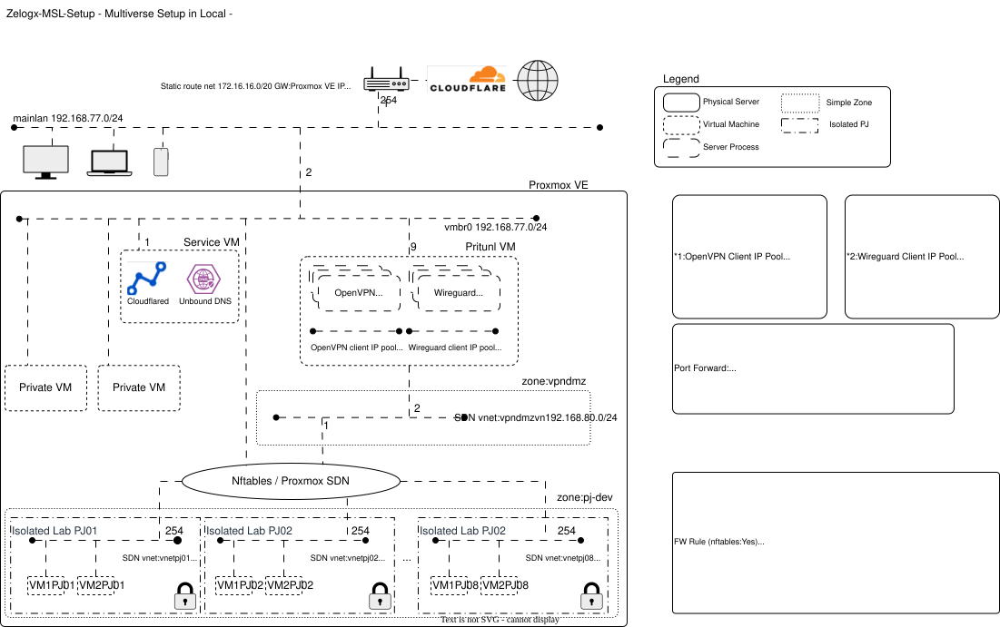
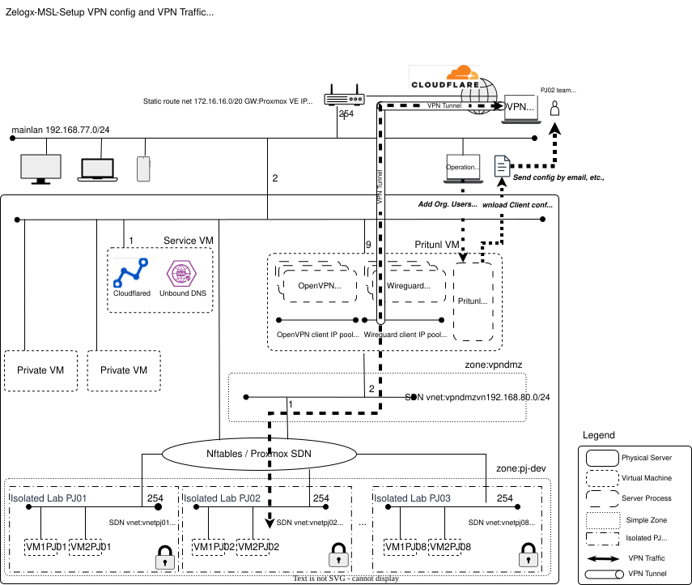

# Architecture Overview

This page provides a high-level visual summary of the Zelogx™ MSL Setup architecture.  
For full details, refer to the main [README](../README.md).

---

## 1. Overall System Architecture

This diagram shows the three-tier structure (mainlan, vpndmz, isolated labs)  
and how Proxmox SDN and Pritunl combine to provide per-project L2/L3 isolation.

---

## 2. Network Segments

Each project receives its own isolated /24 network,  
and VPN client pools are allocated per-project in /28 blocks.

---

## 3. VPN Traffic Flow

This illustrates how VPN clients enter through Pritunl, traverse vpndmz,  
and reach only their assigned project network — with mainlan shielded by PVE Firewall.

## 4. VPN Traffic Flow

The following diagram summarizes how VPN clients traverse vpndmz and reach only their assigned project networks.

---
